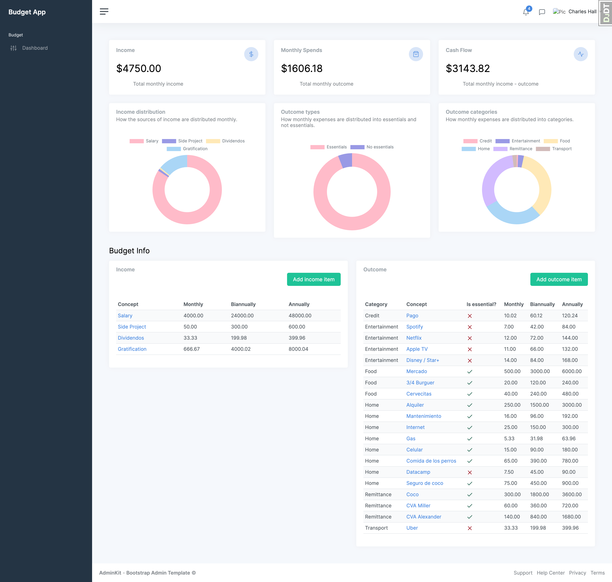

# Django Budget App

This is an application to create a personal budget, record income and expenses, and with this data, visualize the cash
flow, distribution of expenses by category and a projection of savings and expenses.

The objective of this project, together with obtaining a personal finance tool, is to put various Django concepts into
practice.



## Features used

- The main tool versions are Python 3.11, Django 4.2, Postgres 13
- Docker configuration
- PostgresSQL DB implementation
- [Django-allauth](https://django-debug-toolbar.readthedocs.io/en/latest/) configured
- Proper organization of project directories
  - Directory for static files
  - Dedicated app for general pages (like _home_ or _about_ pages)
  - Environment variables usage
- [Django Debug Toolbar](https://django-debug-toolbar.readthedocs.io/en/latest/) usage
- Usage of [AdminKit](https://adminkit.io/#) as Bootstrap Admin template

## Installation
1. Clone this repository
2. Build the containers

```shell
git clone https://github.com/hharrisd/django-budget.git
cd django-budget
docker compose up -d --build
```

## Usage
Once the containers are running, the budget page could be accessed in the route: http://localhost:8000/budget/

## Next features to implement
* Create multiple budgets
* Associate budgets with authenticated users
* Export budgets to CSV or PDF files
* Import data from CSV
* Add DRF for API management